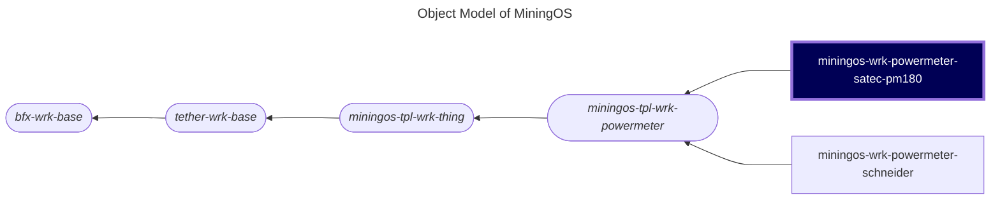

# miningos-wrk-powermeter-satec

## Table of Contents

1. [Overview](#overview)
    1. [Purpose](#purpose)
    2. [Supported Power Meter Types](#supported-power-meter-types)
    3. [Components](#components)
2. [Architecture](#architecture)
    1. [Object Model](#object-model)
    2. [Worker Types](#worker-types)
    3. [Worker Lifecycle](#worker-lifecycle)

## Overview

The Satec Powermeter Worker (`miningos-wrk-powermeter-satec-pm180`) is a specialized service that directly extends [Powermeter Worker](https://github.com/tetherto/miningos-tpl-wrk-powermeter) providing industrial-grade monitoring and management capabilities for **Satec PM180 power meters**. Built on the extensible miningos-tpl-wrk-thing framework, this worker enables real-time data collection, historical analysis, and remote management of power measurement devices through a distributed, rack-based architecture.

This worker serves as a critical component in energy management systems, data center monitoring, and industrial power quality analysis applications, providing high-frequency sampling of electrical parameters with built-in fault tolerance and scalability features.

### Purpose

The Satec PM180 PowerMeter worker is a specialized industrial IoT service designed to interface with Satec PM180 series power meters through Modbus TCP/IP protocol. This worker provides real-time monitoring, data collection, and control capabilities for electrical power measurement infrastructure.

Key capabilities:
- **Real-time Monitoring**: Continuous collection of electrical parameters including voltage, current, power, energy, frequency, and power quality metrics
- **Industrial Protocol Support**: Native Modbus TCP/IP communication with configurable timeout and retry mechanisms
- **Time-series Data Storage**: Automatic logging of power measurements with configurable retention periods
- **Alert Processing**: Detection and notification of power anomalies, quality issues, and communication failures
- **Distributed Architecture**: Rack-based design allows horizontal scaling across multiple worker instances
- **High Availability**: Built-in replication support for mission-critical deployments

### Supported Power Meter Types

Currently, this worker supports the following Satec power meter models:

| Model | Modbus Protocol | Features | Status |
|-------|----------------|----------|---------|
| **PM180** | Modbus TCP/IP | 3-phase monitoring, THD measurement, energy metering | ✅ Fully Supported |

**Note**: While this implementation is specifically designed for the PM180 model, the modular architecture allows for easy extension to support additional Satec power meter models in the future.


## Architecture

### Object Model

The following is a fragment of [MiningOS object model](https://docs.mos.tether.io/) that contains the class representing "Satec power meter" worker (highlighted in blue). The rounded nodes reprsent abstract classes and the one square node represents a concrete class:



### Worker Types
The **Satec PowerMeter** worker fits in fourth level of the following standard inheritance hierarchy:

#### Inheritance Levels

```
Level 1: bfx-wrk-base (Foundation)
    ↓
Level 2: tether-wrk-base (Foundation)
    ↓
Level 3: miningos-tpl-wrk-thing/WrkProcVar (Thing Management Base)
    ↓
Level 4: miningos-tpl-wrk-powermeter (PowerMeter Template)
    ↓
Level 5: Satec power meter worker (as well as other brands') Specific Implementations
```

#### Level 1: [Foundation](https://github.com/bitfinexcom/bfx-wrk-base)
- **bfx-wrk-base**: Core worker functionality (configuration, facilities, lifecycle)

#### Level 2: [Foundation](https://github.com/tetherto/tether-wrk-base)
- **tether-wrk-base**: Core worker functionality (configuration, facilities, lifecycle)

#### Level 3: [Thing Management Base](https://github.com/tetherto/miningos-tpl-wrk-thing)
- **miningos-tpl-wrk-thing (WrkProcVar)**: Abstract base implementing:
  - Thing CRUD operations
  - RPC interface
  - Storage management
  - Replication logic
  - Abstract methods for device interaction

#### Level 4: [PowerMeter Template](https://github.com/tetherto/miningos-tpl-wrk-powermeter/)
- **miningos-tpl-wrk-powermeter (WrkPowerMeterRack)**: Power monitoring specialization:
  - RTD scheduling configuration
  - PowerMeter type definition
  - Tag system for power meters
  - Base methods remain abstract for brand implementation

#### Level 5: Concrete Implementation(s) --- Satec-pm180 
Brand and model-specific worker that implements actual device communication:
